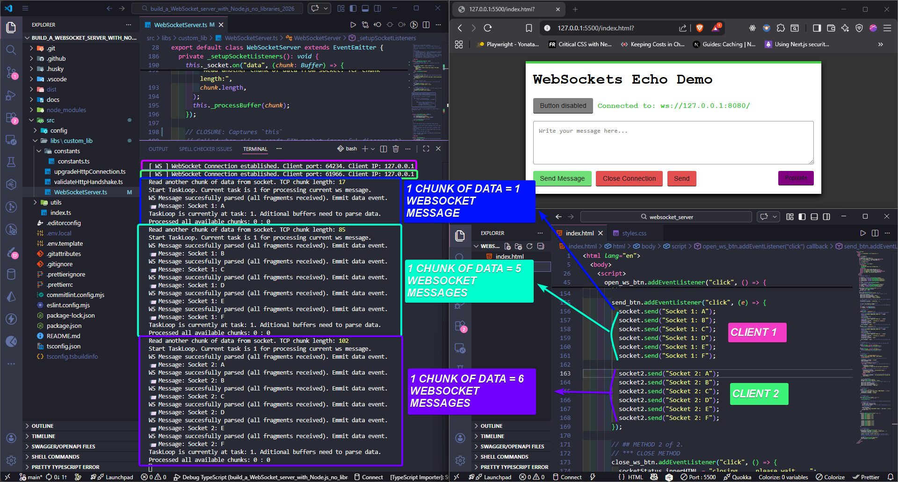
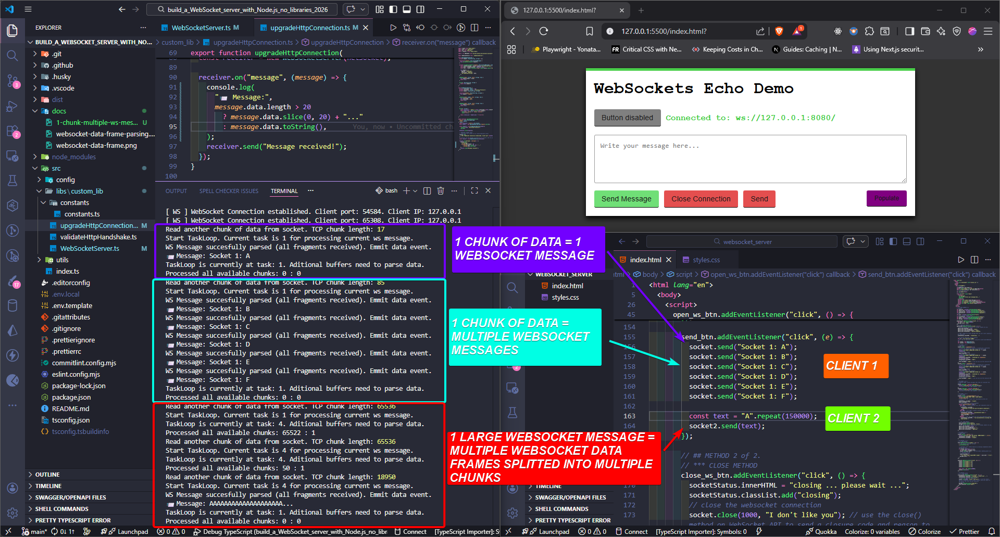

# WebSocket Server Implementation - RFC 6455 Protocol from Scratch

## 🎯 Project Objectives

- **RFC 6455 Specification Interpretation & Implementation** - Build a WebSocket server that strictly adheres to the official protocol specification, understanding protocol design decisions (`UpgradeHeadersBuilder`, `HttpResponseBuilder`, `WebSocketServer`)

- **Incremental TCP Chunk Parsing with Custom Reusable Logic** - Implement `_consume()` method to handle fragmented TCP data arriving unpredictably, enabling parsing of WebSocket frames that span multiple TCP segments or bundled together in one segment

- **Binary Data Manipulation & Interpretation** - Working directly with bytes: bitwise operations for extracting FIN/opcode/mask bits, big-endian decoding, and XOR-based unmasking (`_getInfo()`, `_unmaskDataPayload()`)

- **Deep WebSocket Protocol Understanding via Binary Frame Construction** - Hand-craft WebSocket frames in binary format exactly as transmitted over the wire, understanding why each bit and byte is positioned as it is (`send()` method, frame header assembly)

- **Incremental Message Parsing Mechanism for Arbitrary Payload Sizes** - Support fragmented messages of any length through multi-frame accumulation without memory exhaustion (`_fragments` array, `_totalPayloadLength`, `_processLength()`)

- **WebSocket Connection Closure with Proper TCP Termination** - Implement graceful close handshake: parse close frames, respond with close frame, emit closure event, and properly terminate underlying TCP connection (`_getCloseInfo()`, `_sendClose()`)

- **Frame Type & Opcode Semantics with RFC-Compliant Validation** - Distinguish between text, binary, control (close/ping/pong) frames and enforce their specific rules (fragmentation constraints, payload limits) (`_isControlFrame()`, opcode validation in `_getInfo()`)

- **Simple Event-Driven Interface** - Expose clean API accepting a socket object with two event listeners: "message" for incoming data and "close" for connection termination (`WebSocketServer` extends `EventEmitter`, `_setupSocketListeners()`)

- **Message Broadcast via Simple send() Method** - Provide straightforward way to transmit text messages to client with automatic proper frame construction and transmission (`send()` method with variable-length payload encoding)

- **Manual HTTP Upgrade Processing** - Manually handle HTTP 101 upgrade from scratch: extract Sec-WebSocket-Key, compute SHA1 hash, build upgrade headers, format HTTP response with proper CRLF syntax, and transition socket to WebSocket protocol (`upgradeHttpConnection()`, `UpgradeHeadersBuilder`)

- **Variable-Length Payload Size Encoding** - Support three payload encoding schemes: direct (0-125 bytes), 16-bit big-endian (126-65535 bytes), and 64-bit big-endian (>65535 bytes) with proper decoding logic (`_getLength()` with `readUInt16BE()`, `readBigUInt64BE()`)

- **State Machine-Based Incremental Parsing** - Implement task-based state machine with 6 states (GET_INFO → GET_LENGTH → GET_MASK_KEY → GET_PAYLOAD → EMMIT_DATA/GET_CLOSE_INFO) that survives incomplete data by yielding control and resuming from same state (`_startTaskLoop()`, task constants)

- **Client Masking Validation & Payload Unmasking** - Enforce RFC requirement that all client-to-server frames must be XOR-masked, validate mask presence, and correctly unmask payload by XORing with 4-byte cyclic key (`_masked` validation, `_unmaskDataPayload()`)

- **Multiple WebSocket Messages in Single TCP Chunk** - Design buffer management that preserves unconsumed data after processing complete message, enabling parser to immediately start next message without loss (`_reset()` intentionally excludes `_buffersArray` reset)

- **Payload Size Security Limits** - Implement maximum payload enforcement to prevent memory exhaustion and DoS attacks, tracking cumulative size across fragmented messages and rejecting oversized payloads with proper close code (`_maxPayload`, `_processLength()`)

- **Connection Lifecycle via Closures** - Leverage JavaScript closures on socket event listeners to automatically maintain WebSocket instance lifetime, preventing premature garbage collection while connection is active (`_setupSocketListeners()` creates closures capturing `this`)

- **Error Handling with Protocol-Compliant Response** - Catch parser errors and respond with appropriate WebSocket close frame (code 1002 for protocol error) before socket destruction, ensuring clean protocol termination (`_processBuffer()` try-catch, `_sendClose()`)

- **Buffer Consumption Strategy for Efficient Memory Usage** - Design `_consume(n)` to extract exactly N bytes from array of buffers, handling spans across buffer boundaries, removing consumed buffers, and updating byte counter without unnecessary reallocations

- **Frame Fragmentation Reassembly** - Accumulate payload fragments when FIN bit is 0, track total length across frames, and reassemble into complete message by concatenating when FIN=1, then reset state for next message (`_fragments`, `_emmitDataEvent()`)

